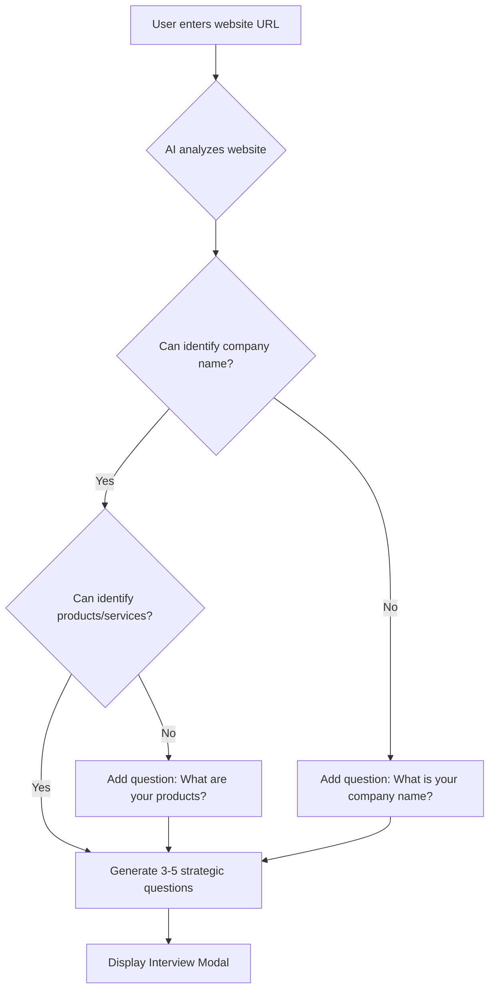
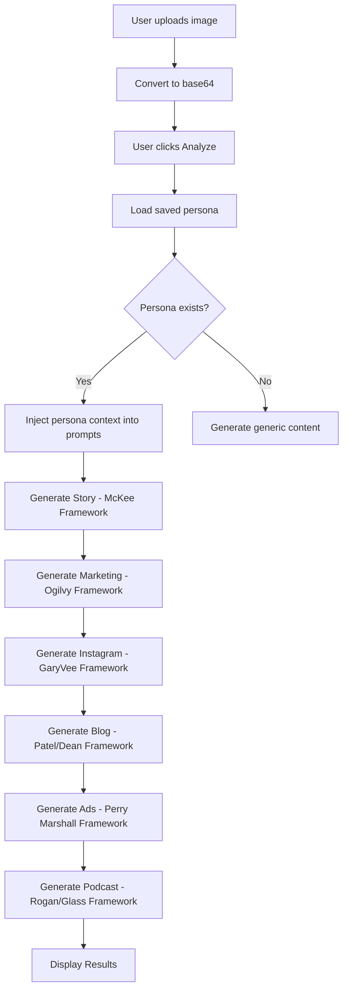
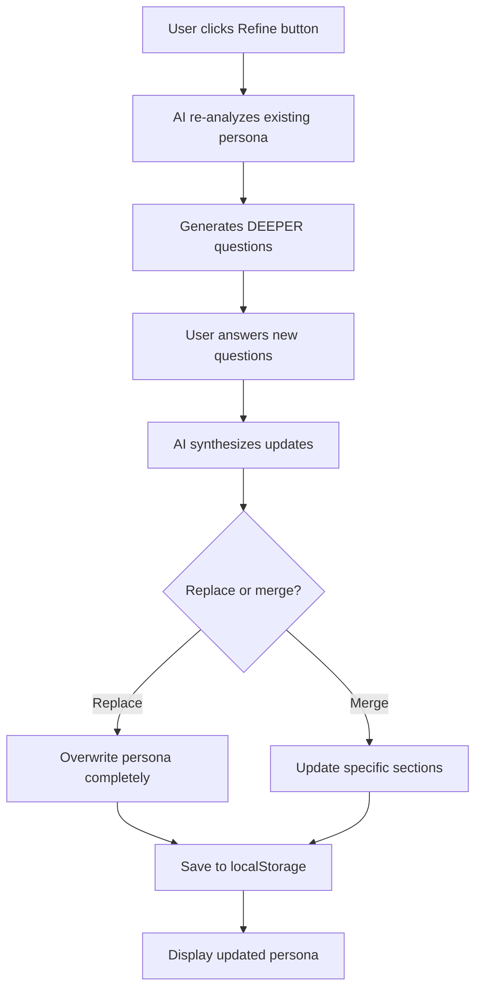

# Workflows - AI Scene Detective

This document explains the complete workflows, decision trees, and best practices for each feature.

---

## Table of Contents

1. [Persona Generation Workflow](#persona-generation-workflow)
2. [Content Generation Workflow](#content-generation-workflow)
3. [Refinement Workflow](#refinement-workflow)
4. [Multi-Image Workflow](#multi-image-workflow)
5. [Agency Workflow](#agency-workflow)

---

## Persona Generation Workflow

### Overview
The persona generation uses a two-phase approach: **Research → Interview → Synthesis**.

### Phase 1: Initial Research



**What the AI Analyzes:**
- Company name and branding
- Product/service offerings
- Industry and niche
- Target audience signals
- Competitive positioning clues
- Brand voice indicators

**Accuracy Lock Feature:**
If the AI encounters ambiguity (e.g., "Great Escape" could be escape rooms, pool company, travel agency), it MUST ask for clarification. This prevents generic/wrong personas.

### Phase 2: Interactive Interview

**Question Types:**

1. **Clarification Questions** (Required if ambiguous)
   - "What is the exact official name of your company?"
   - "What are your primary products or services?"

2. **Strategic Questions** (AI-generated based on research)
   - "Who is your ideal customer? (demographics, firmographics)"
   - "What is your main competitive advantage?"
   - "What objections do prospects typically have?"
   - "What tone/voice best represents your brand?"

**User Experience:**
- Questions appear in a modal overlay
- Each has a textarea for detailed answers
- None are technically required (but quality improves with answers)
- User can skip any question

### Phase 3: Synthesis

The AI combines:
- Website analysis
- Interview answers (prioritized over assumptions)
- Industry best practices

**Output Structure:**
```markdown
## 1. COMPANY PROFILE
- Exact Company Name
- Tagline
- Industry & Niche

## 2. BRAND VOICE & PERSONALITY
## 3. TARGET AUDIENCE
## 4. UNIQUE VALUE PROPOSITION
## 5. CONTENT STRATEGY
## 6. COMPETITIVE LANDSCAPE
## 7. MARKETING CHANNELS
## 8. CUSTOMER JOURNEY
## 9. OBJECTIONS & SOLUTIONS
## 10. BRAND GUIDELINES
```

**Storage:**
- Persona saved to `localStorage.customPersona`
- Website URL saved to `localStorage.personaWebsite`
- Client websites saved to `localStorage.personaClients`
- Persists across browser sessions

---

## Content Generation Workflow

### Overview
Single image → 7 content types, each using a different expert framework.

### Step-by-Step Process



### Content Type Details

#### 1. Story (Robert McKee Framework)
**Prompt Components:**
- Three-act structure (Setup → Confrontation → Resolution)
- Hero's journey elements
- Cinematic observation techniques
- Sensory details and character depth

**Output:** 800-1,200 words of narrative prose

**Use Cases:** Email newsletters, case studies, brand storytelling

---

#### 2. Marketing Copy (Ogilvy/Halbert/Schwartz)
**Prompt Components:**
- 5 headline variations (Ogilvy formulas)
- PAS Framework (Problem-Agitate-Solution)
- USP Method (Rosser Reeves)
- Proof points and guarantees
- Multiple CTAs

**Output:** 600-800 words of conversion-focused copy

**Use Cases:** Landing pages, sales letters, email campaigns

---

#### 3. Instagram (Gary Vaynerchuk Method)
**Prompt Components:**
- 5 caption types: Story, Question, Value, BTS, CTA
- Hook optimization (first 125 chars)
- Line breaks and emoji strategy
- Engagement psychology
- Hashtag strategy (3-5 relevant tags)

**Output:** 5 complete caption variations

**Use Cases:** Instagram, Facebook, LinkedIn posts

---

#### 4. Blog Post (Neil Patel + Brian Dean)
**Prompt Components:**
- Skyscraper Technique (10x better content)
- SEO optimization (keyword strategy)
- 5-7 H2 sections with H3 subsections
- Statistics and examples
- Internal/external linking opportunities

**Output:** 1,800+ words with full SEO structure

**Use Cases:** Company blog, guest posts, pillar content

---

#### 5. Google Ads (Perry Marshall)
**Prompt Components:**
- 80/20 principle (highest-intent keywords)
- 15 headlines (30 chars each)
- 4 descriptions (90 chars each)
- Extensions (sitelinks, callouts)
- Negative keyword strategy

**Output:** Complete ad campaign structure

**Use Cases:** Google Search ads, responsive ads

---

#### 6. Podcast Script (Rogan/Glass/Gladwell)
**Prompt Components:**
- Cold open + setup + exploration + reflection + closer
- Conversational style with vocal notes
- Sound effect and music cue suggestions
- 12-15 minute structure

**Output:** ~2,000 words with audio direction

**Use Cases:** Podcasts, YouTube scripts, audio blogs

---

### Generation Sequence
Content is generated **sequentially** (not parallel) with 1.2-second delays to:
- Respect API rate limits
- Provide visual feedback (user sees progress)
- Ensure each generation completes successfully

### Error Handling
- **Model Auto-Detection:** Tries Gemini 2.0 Flash → 1.5 Pro → 1.5 Flash
- **Retry Logic:** Built-in fallback to hardcoded model list
- **User Feedback:** Loading indicator shows current step + retry attempts

---

## Refinement Workflow

### When to Refine
- Company name is incorrect
- Products/services are misunderstood
- Brand voice doesn't match
- Target audience is too broad/narrow
- Want to add more detail

### Refinement Process



**Refinement Questions Are Different:**
- More specific to industry/niche
- Focus on gaps in original persona
- Ask about edge cases and nuances

**Example Refinement Questions:**
- "What percentage of your clients are in [specific industry]?"
- "How do you differ from [specific competitor]?"
- "What's your average deal size?"

---

## Multi-Image Workflow

### Scenario: Marketing Campaign (Multiple Assets)

**Step 1:** Generate persona once
```
Brand Configuration → Interview → Persona Generated
```

**Step 2:** Generate content for Image 1
```
Upload Image 1 → Analyze → Export all 7 content types to PDF
```

**Step 3:** Generate content for Image 2
```
Click "Upload Different Photo" → Upload Image 2 → Analyze → Export
```

**Step 4:** Repeat for additional images
```
Same persona is reused automatically
```

**Efficiency Gains:**
- Persona generation: ~90 seconds (once)
- Per-image analysis: ~60 seconds
- 10 images = ~11 minutes total (vs ~25 minutes if regenerating persona each time)

---

## Agency Workflow

### Scenario: Multi-Client Agency

**Client 1: Law Firm**
```
1. Enter client website URL
2. Generate persona for legal industry
3. Upload 5 courtroom/office photos
4. Generate content for each
5. Export all to PDF
6. Click "Reset" when done
```

**Client 2: Restaurant**
```
7. Enter new website URL
8. Generate restaurant persona
9. Upload 5 food/interior photos
10. Generate content for each
11. Export all to PDF
```

**Best Practices:**
- Use browser tabs (one per client)
- Name PDF exports clearly: `client-name_contenttype_date.pdf`
- Keep notes on which images produced best content
- Reuse personas for ongoing client work

---

## Decision Tree: What Content Type to Use

```
Is your goal conversion/sales?
├─ Yes → Marketing Copy (Ogilvy framework)
└─ No → Keep reading...

Is it for social media?
├─ Yes → Instagram Captions (GaryVee framework)
└─ No → Keep reading...

Is it for search engines?
├─ Yes → Blog Post (Patel/Dean framework)
└─ No → Keep reading...

Is it for paid advertising?
├─ Yes → Google Ads (Perry Marshall framework)
└─ No → Keep reading...

Is it for audio/video?
├─ Yes → Podcast Script (Rogan/Glass framework)
└─ No → Keep reading...

Do you want an engaging narrative?
└─ Yes → Story (Robert McKee framework)
```

---

## Advanced Workflows

### Workflow 1: Content Repurposing
```
1. Upload product launch photo
2. Generate all 7 content types
3. Use Story for email announcement
4. Use Marketing Copy for landing page
5. Use Instagram for social launch
6. Use Blog for SEO content
7. Use Ads for paid campaign
8. Use Podcast for YouTube video script
```

### Workflow 2: A/B Testing
```
1. Generate persona once
2. Upload Image A (professional studio shot)
3. Export Marketing Copy A
4. Click "Upload Different Photo"
5. Upload Image B (candid behind-scenes)
6. Export Marketing Copy B
7. Test both in ads to see which converts better
```

### Workflow 3: Seasonal Campaigns
```
Q1: Holiday photos → Generate content → Export → Archive
Q2: Spring photos → Generate content → Export → Archive
Q3: Summer photos → Generate content → Export → Archive
Q4: Fall photos → Generate content → Export → Archive

(Keep persona consistent across all seasons)
```

---

## Performance Optimization Tips

1. **Batch Image Preparation:**
   - Resize images to ~1920px width before upload
   - Compress to reduce file size (faster upload)
   - Name files descriptively

2. **API Quota Management:**
   - Free tier: ~60 requests/minute
   - Each image = 7 requests
   - Generate ~8 images/minute max
   - For high volume, consider paid tier

3. **Browser Performance:**
   - Close other tabs to free memory
   - Clear localStorage if switching clients frequently
   - Refresh page between major sessions

---

**Next:** [Persona Feature Deep Dive](persona_feature.md)
